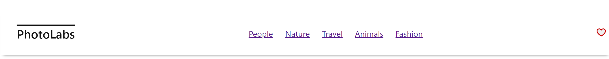
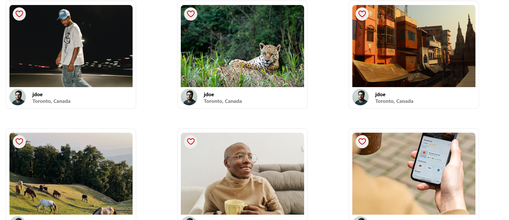
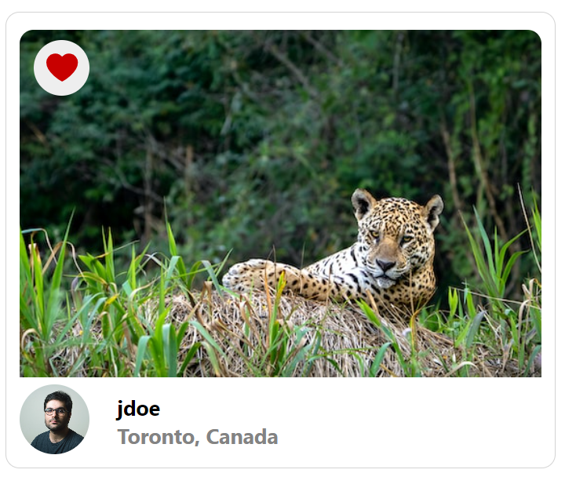
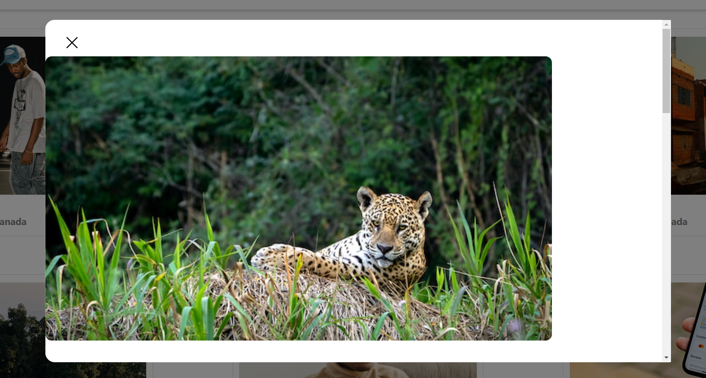
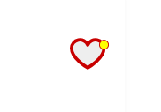

# PhotoLabs

A React single page application (SPA) that allows users to explore, view, and like photos from various categories.
example
## 🌟 Features

- **Photo Viewing**: Users can view photos on the homepage loaded dynamically from the API.
- **Topics/Categories**: Users can navigate to different photo categories, also known as topics.
- **Photo Details**: Users can click on a photo to view a larger version along with similar or relevant photos.
- **Photo Liking**: Users can "like" a photo from any view within the application.
- **Navigation Notifications**: A heart icon in the navigation displays a notification for liked photos.
- **Persistence**: The client-side application communicates with an API to load and persist data. This ensures that data (e.g., liked photos) is not lost after a session restarts.

## 🛠 Technical Stack

- **Frontend**: React (SPA)
- **Backend**: Node with Express.js
- **Database**: PostgreSQL

## 📡 API Communication

The client communicates with the API over HTTP using the JSON format.

## 🚀 Getting Started

1. **Clone the repository**:

   git clone [repository-url]

2. **Navigate to the project directory**:
cd PhotoLabs

3. **Install dependencies**:
npm install

4. **Start the development server**:
npm start

## ScreenShots

